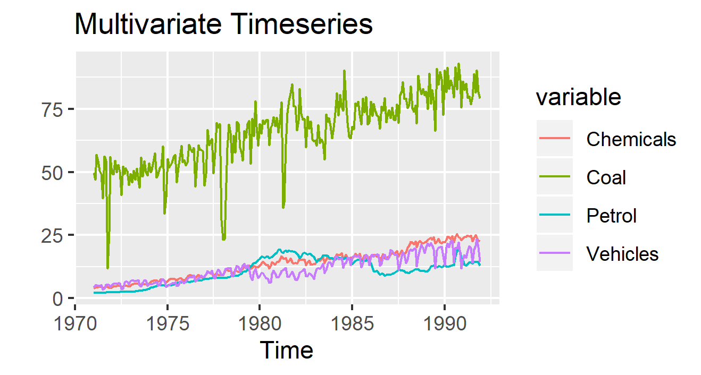

# mlr3forecasting

Forecasting for mlr3

<!-- badges: start -->
[](https://travis-ci.org/mlr-org/mlr3forecasting)
[](https://cran.r-project.org/package=mlr3forecasting)
[](https://codecov.io/gh/mlr-org/mlr3forecasting)
[](https://stackoverflow.com/questions/tagged/mlr3)
<!-- badges: end -->

This package extends the [mlr3](https://github.com/mlr-org/mlr3) package
framework by timeseries prediction and resampling methods.

<!-- -->

## Installation

Install the development version from
GitHub:

``` r
remotes::install_github("mlr-org/mlr3forecasting")
```

## Forecasting

### Forecasting tasks

| Name          | Code                   | Type                    |
|---------------|------------------------|-------------------------|
| airpassengers | `tsk("airpassengers")` | Univariate Timeseries   |
| petrol        | `tsk("petrol")`        | Multivariate Timeseries |

### Forecasting Learners

| Id                                                                                               | Learner               | Package                                                 |
|--------------------------------------------------------------------------------------------------|-----------------------|---------------------------------------------------------|
| [auto.arima](https://mlr3forecasting.mlr-org.com/reference/mlr_learners_regr.AutoArima.html)     | Auto Arima            | [forecast](https://cran.r-project.org/package=forecast) |
| [forecast.average](https://mlr3forecasting.mlr-org.com/reference/mlr_learners_regr.Average.html) | Average               | base                                                    |
| [VAR](https://mlr3forecasting.mlr-org.com/reference/mlr_learners_regr.VAR.html)                  | Vector Autoregression | [vars](https://cran.r-project.org/package=vars)         |


## Code Example

```r
library(mlr3)
library(mlr3forecasting)
library(tsbox)

# Univariate Timeseries

task = tsk("airpassengers")
learner = LearnerRegrForecastAverage$new()
learner$train(task,row_ids = 1:20)
learner$model
p = learner$predict(task,row_ids = 21:55)
p$score(msr("forecast.mae"))
autoplot(task)
```

## Resampling

#### Holdout 

Split data into a training set and a test set.
Parameter `ratio` determines the ratio of observation going into the training set (default: 2/3).

```r
task = tsk("petrol")
learner = LearnerRegrForecastVAR$new()

rr = rsmp("forecastHoldout", ratio = 0.8)
rr$instantiate(task)
resample = resample(task, learner, rr, store_models = TRUE)
resample$predictions()
```

#### Rolling Window CV 

Splits data using a `folds`-folds (default: 10 folds) rolling window cross-validation.

```r
task = tsk("petrol")
learner = LearnerRegrForecastVAR$new()

rr = rsmp("RollingWindowCV", folds = 5, fixed_window = F)
rr$instantiate(task)
resample = resample(task, learner, rr, store_models = TRUE)
resample$predictions()
```


